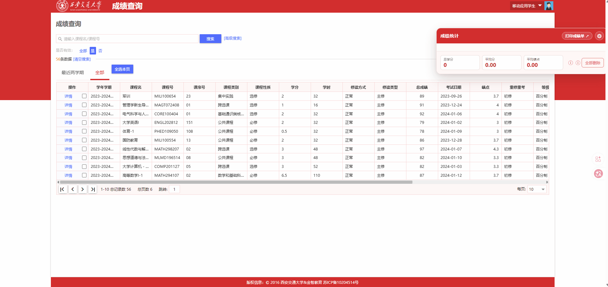
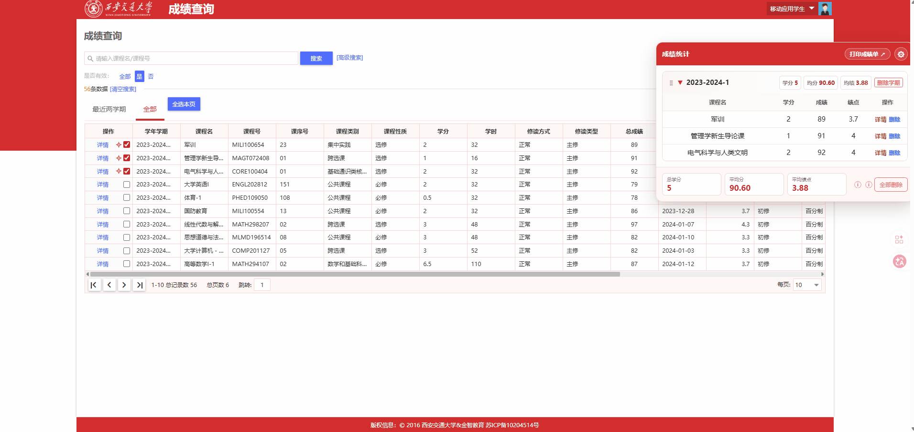
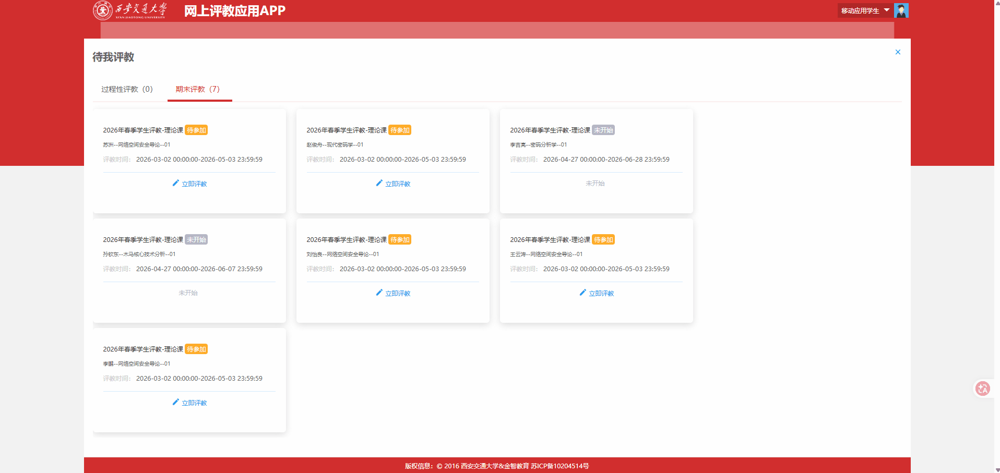
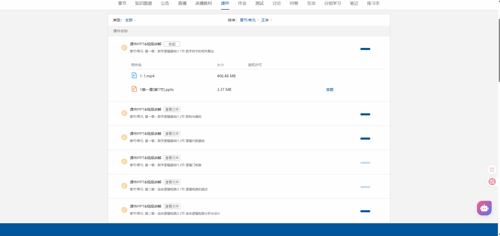

# xjtu-tools

[](https://opensource.org/licenses/MIT)   [](https://developer.chrome.com/docs/extensions/)

这是一个方便**XJTUers**的效率工具，可以在[西交本科教务官网](https://ehall.xjtu.edu.cn/new/index.html?browser=no)帮助你查询小分成绩、计算平均成绩（绩点）、一键评教、方便选课平台登录、形策平台视频可后台播放以及在[学习平台](https://lms.xjtu.edu.cn/user/index#/)下载学习资源等功能。

## 功能特性

- **核心功能1**：通过可拖动的课程详情面板查看完整成绩信息；支持同时展开多门课程进行对照，并可快速定位已选课程在统计面板中的位置。
  
- **核心功能2**：计算各学期及全部所选课程的学分、平均成绩、平均绩点；可一键去除或加回“基础通识类选修课”和“基础通识类核心课”；支持通过齿轮自定义等级换算分数、绩点、平均方式、小数位数和及格线，并可拖动调整学期顺序、快捷跳转学校官网打印成绩单。
  
- **核心功能3**：一键评教。
  
- **核心功能4**：下载学习资源。
  

> **⚠️ 重要免责声明**
> 本工具下载的PDF文档可能受版权保护。**使用者必须注意：**
>
> - 📕 仅限用于个人学习、研究或欣赏
> - 🚫 禁止将下载的内容用于任何商业用途
> - 🔒 尊重知识产权，不得随意传播或分享受版权保护的PDF
> - ⚖️ 用户需自行承担因不当使用导致的法律责任
> - 📝 请在下载后24小时内删除，如需长期保存请购买正版
- **核心功能5**：方便选课平台登录。
- **核心功能6**：形策平台视频可后台播放
- **核心功能7**：选课“盯盘”——盯住心仪课程，出现空位后自动提交选课，并通知最终结果。

## 安装方法

由于未上架Chrome应用商店，请通过以下方式手动安装：

### 推荐：下载zip文件（最稳定）
1.  下载 `zip` 文件。
2.  将下载的ZIP文件**解压**到电脑上一个你会长期保留的文件夹。
3.  打开Chrome浏览器，在地址栏输入 `chrome://extensions/` 并访问。
4.  打开页面右上角的 **“开发者模式”** 开关。
5.  点击页面左上角的 **“加载已解压的扩展程序”** 按钮。
6.  在弹出的文件选择器中，选中**第3步中解压得到的整个文件夹**，然后点击“选择文件夹”。
7.  安装完成！扩展的图标通常会出现在浏览器工具栏的拼图按钮里。

**注意：在第7步中一定选择直接含有`manifest.json`的文件夹**

扩展会在浏览器启动或重新打开第一个窗口时对比本地版本与 GitHub 主分支版本。发现新版本后会自动打开扩展面板，也可随时点击工具栏中的扩展图标查看版本状态。如暂不想更新，可选择“本版本不再提醒”；GitHub 发布更高版本后会恢复提醒。通过 **Code → Download ZIP** 下载最新代码，解压覆盖原文件后，在 `chrome://extensions/` 中点击“重新加载”即可完成更新。

### 开发者：从源码安装
如果你想贡献代码或体验最新开发版：
```bash
git clone https://github.com/another-le/xjtu-tools.git
cd xjtu-tools
```

---
## 更多类似项目推荐（不同平台）
### 移动端 App
- **仓库地址**：[xjtu-toolbox-android](https://github.com/yeliqin666/xjtu-toolbox-android)
- **适用平台**：Android

### 桌面端客户端
- **仓库地址**：[XJTUToolBox](https://github.com/yan-xiaoo/XJTUToolBox)
- **适用平台**：Windows/Mac/Linux
  

欢迎体验不同平台版本，也欢迎给两个项目点个 Star ✨
